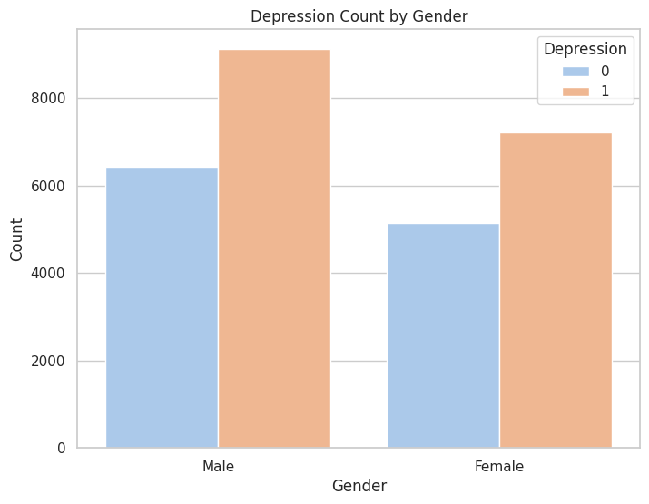
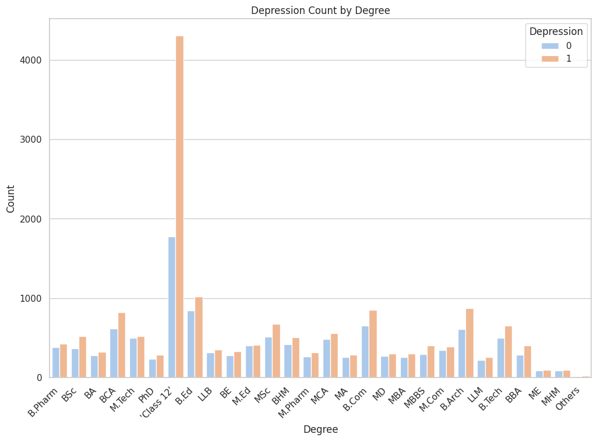

# Depression Analysis Among Students 📊🧠

## Project Overview

**Depression** is a common but serious mental health condition that affects how individuals think, feel, and function in daily life. It can lead to emotional and physical problems, and in severe cases, even suicidal thoughts.

Among various social classes and demographics, students—especially in secondary and tertiary institutions—are increasingly vulnerable to depression due to:

- Academic pressure  
- Social expectations  
- Poor coping mechanisms  
- Inadequate support systems  

**Goal:**  
Understanding the patterns and predictors of depression among students is critical. It helps in:

- Designing timely interventions  
- Shaping school mental health policies  
- Promoting emotional well-being  

This analysis aims to identify key risk factors and target support efforts toward the most affected groups, ultimately fostering a healthier learning environment.

---

## Dataset

- **Source:** [Kaggle - Student Depression Dataset](https://www.kaggle.com/datasets/adilshamim8/student-depression-dataset)
- **Attributes:**
  - **id**
  - **Gender**
  - **Age:** 18 - 59 years (mean ~26 years)
  - **City**
  - **Profession:** Majority of respondents are **college/university students** or early professionals.
  - **Academic Pressure**
   .
   .
   .
  - **Financial Stress**
  - **Mental Illness**
  - **Depression**
    
---

## Tools & Libraries Used

- **Python 3**
- **Pandas** - Data manipulation and analysis  
- **NumPy** - Numerical computing  
- **Matplotlib** - Data visualization  
- **Seaborn** - Advanced visualization
- **SkLearn** - Machine Learning

---

## Process

1. **Data Loading**
    ```python
    import pandas as pd
    import numpy as np
    import matplotlib.pyplot as plt
    import seaborn as sns
    
    Depression_data = pd.read_csv('/content/drive/MyDrive/student_depression_dataset.csv')
    ```

2. **Data Exploration**
    - Display data structure:
        ```python
        Depression_data.head()
        Depression_data.info()
        Depression_data.duplicated().sum()
        ```
    - Check for missing values and data types.
    - Understand the distribution of key variables (Age, CGPA, Depression indicators).

3. **Feature Engineering & Cleaning**
    - Remove duplicates.
    - Handle missing values if applicable.
    - Prepare variables for visualization and modeling.

4. **Visualizations**
    ### Gender distribution
   
    ### Relationship between Professional degree and depression level.
   
    ### Correlation Heatmap
   

6. **Machine Learning**
    - Import some necessary libraries for machine learning
      - Display data structure:
        ```python
        from sklearn.model_selection import train_test_split
        from sklearn.preprocessing import LabelEncoder, StandardScaler
        from sklearn.ensemble import RandomForestClassifier, GradientBoostingClassifier
        from sklearn.linear_model import LogisticRegression
        from sklearn.svm import SVC
        from sklearn.neighbors import KNeighborsClassifier
        from sklearn.metrics import accuracy_score
        from sklearn.metrics import classification_report, confusion_matrix, accuracy_score
        ```
    - Prepare Dataset
        ```python
        # Select only numerical columns for X and drop the target column
        X = D_data.drop(columns=['Depression', 'id'], errors='ignore')
        X = X.select_dtypes(include=['int64', 'float64'])
        
        y = D_data['Depression']

        # Split dataset into Train and test
        X_train, X_test, y_train, y_test = train_test_split(X, y, test_size=0.2, random_state=42)

        # Scale the dataset
        scaler = StandardScaler()
        X_train = scaler.fit_transform(X_train)
        X_test = scaler.transform(X_test)
        ```
    - Train the machine learning model
        ```python
        model = RandomForestClassifier(n_estimators=100, random_state=42)
        model.fit(X_train, y_train)
        ```
    - Model evaluation
       ```python
       y_pred = model.predict(X_test)
      print("Random Forest Classification Report:")
      print("Accuracy:", accuracy_score(y_test, y_pred))
      print("Classification Report:\n", classification_report(y_test, y_pred))
      print("Confusion Matrix:\n", confusion_matrix(y_test, y_pred))
       ```

---

## Key Insights

✅ Majority of the respondents fall within the early 20s age group—indicating this cohort is particularly vulnerable.  
✅ CGPA and academic stress show relationships with depression levels.  
✅ Gender and profession also contribute to differing depression risks.  
✅ Targeted mental health support is needed for **students** at risk.

---

## Next Steps

- Expand analysis with more features (e.g., social activity, lifestyle habits).
- Explore predictive modeling (Logistic Regression, Random Forest) for depression likelihood.
- Integrate results with **school support programs**.

---

## Conclusion

This project is a small but important step toward using **data science for social good**.  
Understanding student depression patterns allows institutions to implement better **preventive** and **responsive** measures.

---
